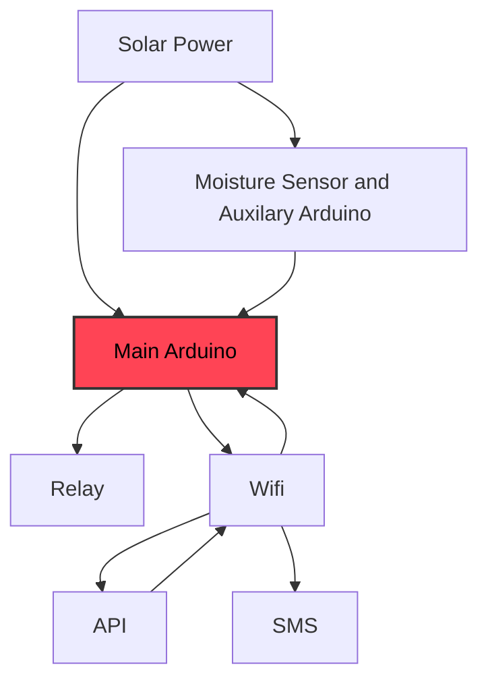

```mermaid
graph TD
    A["Solar Power"] --> B["Main Arduino"]
    A["Solar Power"] --> D["Moisture Sensor and Auxilary Arduino"]
    B["Main Arduino"] --> H["Relay"]
    B["Main Arduino"] --> C["Wifi"]
    C["Wifi"] --> E["API"]
    E["API"] --> C["Wifi"]
    C["Wifi"] --> F["SMS"]
    C["Wifi"] --> B["Main Arduino"]
    D["Moisture Sensor and Auxilary Arduino"] --> B["Main Arduino"]
    classDef red fill:#f45,stroke:#333,stroke-width:2px;
    style B color:black;
    class B red;
```

