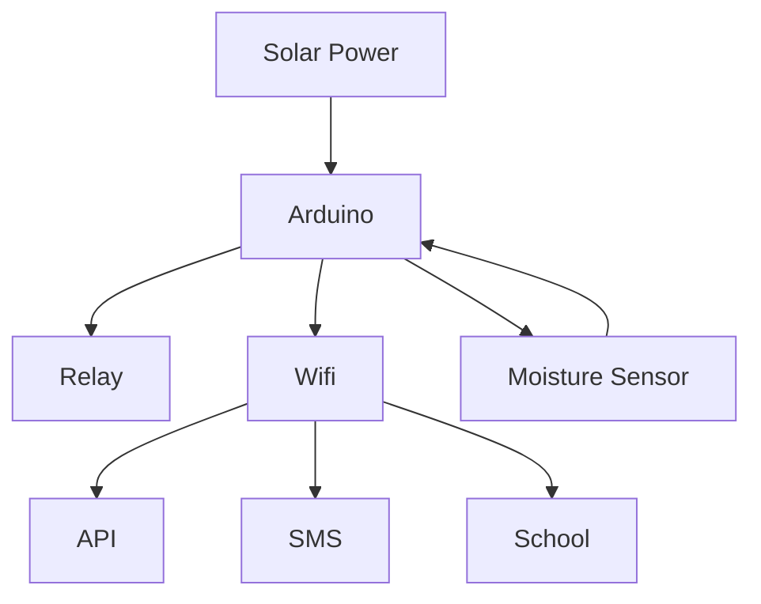

```mermaid
graph TD
    A["Solar Power"] --> B["Arduino"]
    B["Arduino"] --> H["Relay"]
    B["Arduino"] --> C["Wifi"]
    B["Arduino"] --> D["Moisture Sensor"]
    C["Wifi"] --> E["API"]
    C["Wifi"] --> F["SMS"]
    C["Wifi"] --> G["School"]
    D["Moisture Sensor"] --> B["Arduino"]
```
